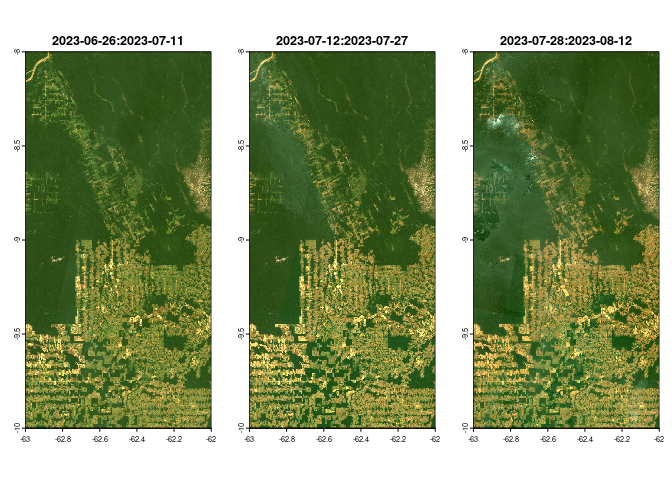
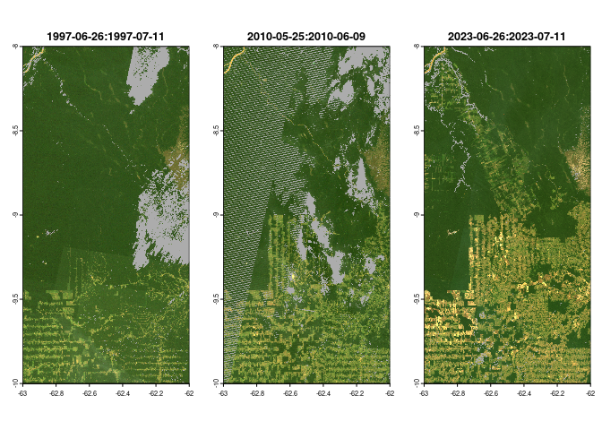

<!-- README.md is generated from README.Rmd. Please edit that file -->

# ardglad

<!-- badges: start -->

[](https://lifecycle.r-lib.org/articles/stages.html#experimental)
<!-- badges: end -->

The goal of ardglad is to provide access to the Global Land Analysis &
Discovery (GLAD) Landsat Analysis Ready Data (ARD). The [GLAD
ARD](https://www.glad.umd.edu/ard/home#format) represents a 16-day time
series of globally consistent, tiled Landsat normalized surface
reflectance from 1997 to the present operationally updated every 16
days.

This package interacts with the [GLAD ARD
API](https://www.glad.umd.edu/ard/home#download) to download and process
the data.

## Installation

You can install the development version of ardglad like so:

``` r
# install.packages("pak")
pak::pkg_install("TESS-Laboratory/ardglad")
```

## Example

Here is an example of how to generate the urls for the GLAD ARD tiles
for an example location in Rondônia, Brazil.

``` r
library(ardglad)

rondonia_eg <- sf::st_point(c(-62.625, -8.989)) |>
  sf::st_sfc(crs = 4326) |>
  sf::st_buffer(20000)

ron_urls <- ard_glad_urls(
  rondonia_eg,
  start_date = "2023-07-01",
  end_date = "2023-07-30"
)

print(ron_urls)
#> 
#> ── < ARD GLAD urls >
#> 
#> ── [[1]] 2023-06-26:2023-07-11 ─────────────────────────────────────────────────
#> https://glad.umd.edu/dataset/glad_ard2/09S/062W_09S/1001.tif
#> https://glad.umd.edu/dataset/glad_ard2/08S/062W_08S/1001.tif
#> 
#> ── [[2]] 2023-07-12:2023-07-27 ─────────────────────────────────────────────────
#> https://glad.umd.edu/dataset/glad_ard2/09S/062W_09S/1002.tif
#> https://glad.umd.edu/dataset/glad_ard2/08S/062W_08S/1002.tif
#> 
#> ── [[3]] 2023-07-28:2023-08-12 ─────────────────────────────────────────────────
#> https://glad.umd.edu/dataset/glad_ard2/09S/062W_09S/1003.tif
#> https://glad.umd.edu/dataset/glad_ard2/08S/062W_08S/1003.tif
```

And now let’s download the data and plot it. Note that although an
object of class `ard_glad` is returned, in reality this is just a list
of SpatRasters and can be coerced back to a list with `as.list`.

``` r
ron_ras <- ard_glad_download(ron_urls, "rondonia_glad")
#> ℹ Downloading files for time period: 2023-06-26:2023-07-11
#> ℹ Downloading files for time period: 2023-07-12:2023-07-27
#> ℹ Downloading files for time period: 2023-07-28:2023-08-12

print(ron_ras)
#> 
#> ── < ARD GLAD rasters>
#> 
#> ── [[1]] 2023-06-26:2023-07-11 ─────────────────────────────────────────────────
#> class       : SpatRaster 
#> dimensions  : 8004, 4004, 8  (nrow, ncol, nlyr)
#> resolution  : 0.00025, 0.00025  (x, y)
#> extent      : -63.0005, -61.9995, -10.0005, -7.9995  (xmin, xmax, ymin, ymax)
#> coord. ref. : lon/lat WGS 84 (EPSG:4326) 
#> source      : rondonia_glad_2023_06_26_2023_07_11.vrt 
#> names       : B, G, R, N, S1, S2, ...
#> 
#> ── [[2]] 2023-07-12:2023-07-27 ─────────────────────────────────────────────────
#> class       : SpatRaster 
#> dimensions  : 8004, 4004, 8  (nrow, ncol, nlyr)
#> resolution  : 0.00025, 0.00025  (x, y)
#> extent      : -63.0005, -61.9995, -10.0005, -7.9995  (xmin, xmax, ymin, ymax)
#> coord. ref. : lon/lat WGS 84 (EPSG:4326) 
#> source      : rondonia_glad_2023_07_12_2023_07_27.vrt 
#> names       : B, G, R, N, S1, S2, ...
#> 
#> ── [[3]] 2023-07-28:2023-08-12 ─────────────────────────────────────────────────
#> class       : SpatRaster 
#> dimensions  : 8004, 4004, 8  (nrow, ncol, nlyr)
#> resolution  : 0.00025, 0.00025  (x, y)
#> extent      : -63.0005, -61.9995, -10.0005, -7.9995  (xmin, xmax, ymin, ymax)
#> coord. ref. : lon/lat WGS 84 (EPSG:4326) 
#> source      : rondonia_glad_2023_07_28_2023_08_12.vrt 
#> names       : B, G, R, N, S1, S2, ...

par(mfrow = c(1, 3))
plot(ron_ras)
```



We can also query specific moments through time, by specifying multiple
`start_date` values, like so:

``` r
ron_urls_97_23 <- ard_glad_urls(
  rondonia_eg, c("1997-06-30", "2010-06-01", "2023-06-30")
)
```

Now we can download these data and mask clouds, shadows and haze, ready
for further analysis:

``` r
ron_ras_97_23_masked <- ard_glad_download(ron_urls_97_23, "rondonia_glad") |>
  ard_glad_mask()
#> ℹ Downloading files for time period: 1997-06-26:1997-07-11
#> ℹ Downloading files for time period: 2010-05-25:2010-06-09
#> ℹ Downloading files for time period: 2023-06-26:2023-07-11

par(mfrow = c(1, 3))
plot(ron_ras_97_23_masked)
```


